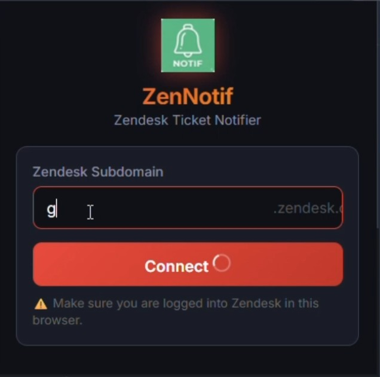
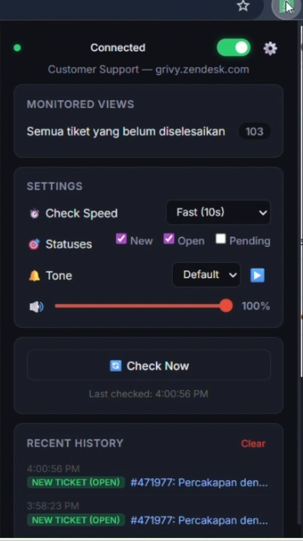
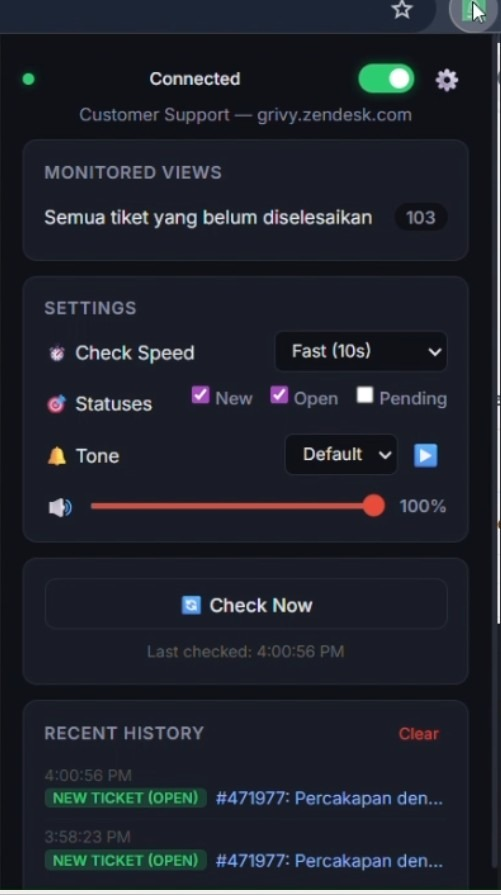

# ZenNotif — Automated Zendesk Ticket Notifications

[](#installation)
[](LICENSE)
[](https://developer.chrome.com/docs/extensions/mv3/intro/)

> Never miss a critical ticket. ZenNotif alerts support teams when new tickets arrive.
>


## 📹 Demo Videos

<table>
  <tr>
    <td width="50%" align="center">
      <a href="docs/videos/Simulation%20set%20up.mp4">
        
      </a>
      <br><br>
      <strong>Setup & Configuration</strong><br>
      <small>Connect your Zendesk account and select views to monitor</small><br><br>
      <a href="docs/videos/Simulation%20set%20up.mp4" download>⬇️ Download MP4</a>
    </td>
    <td width="50%" align="center">
      <a href="docs/videos/Simulation%20ringing.mp4">
        
      </a>
      <br><br>
      <strong>Notification in Action</strong><br>
      <small>Audio alert system responding to new tickets</small><br><br>
      <a href="docs/videos/Simulation%20ringing.mp4" download>⬇️ Download MP4</a>
    </td>
  </tr>
</table>

*Note: These are simulated demonstrations showing the user experience. Actual polling interval is configurable (10s-60s).*

## The Problem

Zendesk **does not provide native sound notifications** for incoming tickets in the Agent Workspace. While the legacy **Live Chat** product has built-in sound alerts, the modern **Messaging** channel — which most teams now use — lacks this critical feature. This has been a [long-standing complaint](https://support.zendesk.com/hc/en-us/community/topics) in the Zendesk community, with agents reporting missed tickets, SLA breaches, and frustrated customers.

Even worse:
- **Agents aren't always on the Zendesk tab** — they switch between tools, emails, and documentation throughout the day. Visual-only indicators on a background tab are invisible.
- **Pop-up notifications disappear in seconds** — agents step away for coffee, a meeting, or a bathroom break. By the time they return, the notification is gone and the ticket sits unnoticed.
- **No persistent audio cue** — without sound, there is nothing to grab an agent's attention when they're not staring at the screen.

The available workarounds are equally limited:
- **API tokens** — security risk & setup friction for non-technical agents
- **Third-party Zendesk apps** — often expensive or unreliable
- **Constant manual refresh** — context switching kills productivity

## The Solution

ZenNotif solves this with **persistent audio alerts that work regardless of which tab you're on**. The sound plays through Chrome's offscreen audio system, so even if you're in Gmail, Slack, or a completely different application — you'll hear it. Agents who are away from their desk will hear the alert the moment they're back in earshot, without needing to check any screen first.

### Key Features

| Feature | Description |
|---------|-------------|
| **Automated Monitoring** | Checks every 10/30/60 seconds based on your preference |
| **Audio Alerts (Cross-Tab)** | Sound plays even when Zendesk is in a background tab or minimized |
| **Multiple Tones** | Bell, Chime, Alert, Soft + adjustable volume to suit your environment |
| **Zero API Setup** | Uses your existing Zendesk session — no tokens needed |
| **Selective Views** | Monitor only the queues that matter to your role |
| **Badge Counter** | See pending tickets at a glance on the toolbar icon |
| **Notification History** | Track recent alerts in the popup dashboard |

## Technical Implementation

Built with **Chrome Manifest V3** for modern extension architecture:

```
┌─────────────────┐     ┌──────────────────┐     ┌─────────────────┐
│   Content Script│────▶│  Service Worker  │────▶│  Offscreen Doc  │
│   (Keep-Alive)  │     │ (Background API) │     │ (Audio Playback)│
└─────────────────┘     └──────────────────┘     └─────────────────┘
                               │  ▲
                               ▼  │
                        ┌──────────────────┐
                        │  Zendesk API     │
                        │ (Session Cookie) │
                        └──────────────────┘
```

**Architecture Highlights:**
- **Service Worker**: Handles background polling and state management
- **Offscreen Document**: Required for audio playback in Manifest V3
- **Content Script**: Keep-alive pinger to prevent service worker hibernation
- **Session Cookie Auth**: Seamless integration without API tokens

[See ARCHITECTURE.md](./ARCHITECTURE.md) for detailed technical documentation.

## Installation

### Load Unpacked (Developer Mode)

1. Download or clone this repository
2. Open Chrome and navigate to `chrome://extensions/`
3. Enable **Developer mode** (toggle in top right)
4. Click **Load unpacked** and select the extension folder
5. Click the ZenNotif icon in your toolbar
6. Enter your Zendesk subdomain (e.g., `yourcompany` from `yourcompany.zendesk.com`)
7. Select views to monitor
8. Done! You'll hear a sound when tickets arrive

## Usage Guide

### First-Time Setup

1. **Connect**: Click the ZenNotif icon → enter your subdomain → click Connect
2. **Select Views**: Choose which ticket queues to monitor (e.g., "Unassigned", "Urgent")
3. **Configure Settings**: Adjust check interval, notification tone, and volume
4. **Enable**: Toggle monitoring ON — the status dot will turn green

### Dashboard Overview



- **Status Bar**: Connection status and enable/disable toggle
- **Monitored Views**: Current ticket counts per view
- **Settings Panel**: Customize your notification preferences
- **History**: Recent ticket notifications with timestamps

### Notification Tones

| Tone | Use Case |
|------|----------|
| **Default** | Plays `notifikasi.mp3` (customizable) |
| **Bell** | Classic "ding-dong" for traditional environments |
| **Chime** | Gentle ascending tones for quiet offices |
| **Alert** | Urgent double beep for critical SLA monitoring |
| **Soft** | Subtle sine wave for minimal disruption |

## Use Cases

### Tier 1 Support Teams
Catch new tickets immediately as they arrive. No more "I didn't see it" excuses.

### Escalation & L2 Teams
Monitor high-priority queues for urgent tickets requiring immediate attention.

### After-Hours & Hybrid Shifts
Audio alerts when you're the only agent online — never miss a critical ticket.

### Customer Operations Managers
Ensure team accountability with visible badge counts and notification history.

## Why This Matters — Industry Comparison

The lack of agent notification sounds isn't unique to Zendesk. Most CRM/helpdesk platforms struggle with the same gap, especially for modern messaging and social channels (WhatsApp, Instagram, Facebook Messenger, etc.):

| Platform | Native Sound for Messaging/Social Channels | Notes |
|----------|---------------------------------------------|-------|
| **Zendesk** | ❌ No | Only legacy Live Chat has sound. Messaging has no audio alert. |
| **Freshdesk** | ❌ No | No native sound for tickets from messaging channels. |
| **Zoho Desk** | ❌ No | No desktop sound. Must rely on mobile app push notifications. |
| **HubSpot** | ⚠️ Limited | Basic pop-up sound only. No custom audio. Workaround via Slack workflows. |
| **Intercom** | ⚠️ Limited | Browser notification only. No persistent audio alert. |
| **Salesforce** | ✅ Yes | Omni-Channel has audio settings, but requires complex admin setup (Presence Configurations + Static Resources). |

ZenNotif fills this gap for Zendesk with **zero configuration overhead** — no admin access, no API tokens, no server infrastructure required.

## Product Decisions & Trade-offs

**Why Manifest V3?**
- Better security model (no persistent background page)
- Aligned with Chrome's future direction
- Requires offscreen document workaround for audio

**Why Session Cookie Auth?**
- Zero setup friction for support agents
- No API token management overhead
- Works with existing Zendesk permissions
- Trade-off: Requires user to be logged into Zendesk in browser

**Why Polling vs. Webhooks?**
- No server infrastructure required
- Works with all Zendesk plans (including Basic)
- Predictable resource usage
- Trade-off: 10-60 second delay vs. instant webhooks

## Roadmap

- [ ] **Slack Integration**: Route notifications to team channels
- [ ] **Analytics Dashboard**: Ticket volume trends and response time metrics
- [ ] **Auto-Assignment Suggestions**: AI-powered ticket routing recommendations
- [ ] **Mobile Companion**: Push notifications via Chrome on Android
- [ ] **Custom Sound Upload**: Use your own notification sounds

## Browser Support

| Browser | Status |
|---------|--------|
| Chrome 109+ | ✅ Fully Supported |
| Edge 109+ | ✅ Supported (Chromium) |
| Opera | ⚠️ Should work (not tested) |
| Firefox | ❌ Not supported (Manifest V3 differences) |

## Contributing

This is a portfolio project, but contributions are welcome! Please open an issue first to discuss proposed changes.

1. Fork the repository
2. Create a feature branch (`git checkout -b feature/amazing-feature`)
3. Commit your changes (`git commit -m 'Add amazing feature'`)
4. Push to the branch (`git push origin feature/amazing-feature`)
5. Open a Pull Request

## License

This project is licensed under the MIT License — see [LICENSE](LICENSE) for details.

## Acknowledgments

- Built for support teams who care about customer experience
- Inspired by the daily challenges of Zendesk agents worldwide
- Thanks to the Chrome Extensions team for Manifest V3 documentation

## About

Built by **Ilham Setiawan** — a Customer Operations professional passionate about support efficiency and delightful user experiences.

[](https://linkedin.com/in/setiawanilham)

---

**Keywords**: chrome extension, zendesk, customer support, ticket notifications, support operations, helpdesk, sla monitoring, productivity tool
